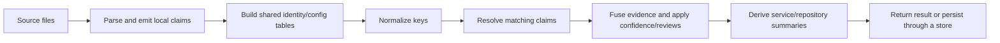

# TraceKite architecture

[Docs](../README.md) · [Product scope](GOAL.md) · [Graph vocabulary](../graph-model.md)

This document is normative for layering, storage, identity, and invariants.
Implementation notes describe the current code; a stated gap does not relax a
requirement. User-facing behavior belongs in the [feature guide](../features.md).

## 1. Scope

TraceKite establishes connections across source repositories and records the
evidence behind them. One scan/link engine serves the CLI, Python facade, MCP,
and optional web app. A host must be able to use it without FastAPI or Neo4j.

Running application code, runtime telemetry, agent planning, and deciding whether
to merge or deploy belong to the host. The proposed
[verification layer](agent-verification-layer.md) and
[Evidence Compiler](../future/evidence-compiler-strategy.md) are future designs,
not shipped interfaces.

## 2. Layering

```text
UI         React views, client state and projections
Server     HTTP/CLI/MCP, configuration binding, jobs, orchestration
Store      GraphStore/LinkerStore adapters and persistence
Parsers    file bytes + path → structured facts and claims
Core       claims, identity, resolvers, graph queries, evidence and confidence
```

Dependencies point down. Parsers and store are siblings and may depend on core,
not on one another. Server code composes them. Core must not require a server,
database driver, environment, network, or UI.

Physical directories are not the layer contract. Some database adapters still
live under `services/`, including `graph_writer.py`, `link_writer.py`,
`graph_reader.py`, and `linker_store.py`. The authoritative module assignment is
[`layer_map.py`](../../backend/tools/layer_map.py); moving one of these concerns
into a resolver would violate the boundary.

| Gate | Checks |
|---|---|
| `backend/tools/check_layers.py` | Import direction, assigned modules, no iterative graph computation in routes |
| `backend/tools/check_invariants.py` | Canonical keys/IDs and shard-state rules |
| `backend/tools/check_annotations.py` | Annotation imports on the Python 3.13 floor |
| `backend/tools/export_openapi.py --check` | Generated HTTP contract matches routes |

The layer checker checks imports, not all I/O. `scan()` and its file scanner
currently read local files while assigned to the parser layer; control-plane
loaders also read YAML. These existing boundaries do not establish full I2
purity. New parsing/resolution logic must accept data and remain independently
testable. Server entry points bind `EngineConfig` and `StoreConfig` explicitly.

## 3. Data model

### 3.1 Claim

A `ClaimRecord` is one repository's observation. It records `id`, `repo_id`,
`kind`, `direction` (`provides` or `consumes`), canonical `key`, service hint,
matchability, attributes, evidence, and the evidence-node identity.
Claims may mention an external hostname or package; they do not inspect another
repository during extraction. [`claims.py`](../../backend/tracekite/services/claims.py)
defines admitted kinds.

### 3.2 Rendezvous

A rendezvous node represents a shared identity: an HTTP/gRPC/GraphQL operation,
library, topic, dataset, service alias, module, deployment unit, or team.
A resolver can declare it before a consumer appears. It is not proof by itself
that two repositories communicate.

### 3.3 Edge

A `GraphEdge` carries source/target identity, relationship type, provenance,
confidence, evidence, status, and available repository attribution. Source
structure and linker edges are separate families. The writer rejects unregistered
types and unreconciled missing endpoints. See [all types](../graph-model.md).

Cross-repository assertions must have supporting evidence for the connection,
including both sides where required by I6. A single declaration can describe
both endpoints. Existing rollups retain bounded citations; neither one string
nor a confidence value alone proves evidence completeness.

### 3.4 Time and versions

Portable artifacts preserve source/revision metadata. Historical questions
reconstruct and compare snapshots; they must not infer history from the current
graph alone. Determinism includes the source, engine, configuration, redaction
identity, and explicit time inputs.

The live Neo4j cache also records `first_seen_at`, link-run identity, and update
times. MERGE can update an existing relationship across runs. Those operational
timestamps are not a substitute for artifact history; portable payloads omit
volatile timestamps for stable bytes.

Package version, `ENGINE_VERSION`, CLI `WIRE_VERSION`, and `ANSWER_VERSION`
are separate contracts. Changes to an answer's meaning require its own version
review. See [`answer.py`](../../backend/tracekite/answer.py) and
[`wire.py`](../../backend/tracekite/wire.py).

## 4. Execution model



[`registry.py`](../../backend/tracekite/services/linker/registry.py) declares
broadcast and join phases. Identity, gateway, and environment state must exist
before key normalization. Join resolvers run against finalized keys (I9).
Ambiguous signals decline with named counters.

The current join is an in-memory indexed computation, not a distributed reduce
service. Library scan orchestration supports parallel repo scans and file
sharding; the Docker ingestion path still parses serially within each repo.
Per-repo artifact reuse exists. Per-file cache reuse and distributed shuffle/
reduce are not shipped; see [incremental scan design](incremental-scan-and-file-context.md).

## 5. Storage

### 5.1 GraphStore

[`GraphStore`](../../backend/tracekite/db/graph_store.py) defines node/edge upserts,
typed `Neighbourhood`, `BoundedPath`, and `Aggregate` queries, and deletion by run.
It accepts query value objects, not arbitrary Cypher/SQL strings.

### 5.2 Backends

| Backend | Implemented role |
|---|---|
| In-memory | Library results and tests without persistence |
| SQLite | Portable artifacts and a local GraphStore adapter |
| Neo4j | Docker application's live graph and a GraphStore adapter |

DuckDB is not a shipped backend. The app is not switched to SQLite by changing a
connection setting. MCP/facade queries traverse their own in-memory link result;
source-node identity can be looked up lazily in artifact SQLite databases.

### 5.3 Artifacts and compaction

`write_artifact()` writes a canonical SQLite file with a content-derived name.
`compact()` merges artifact records into SQLite and reports unreadable or
incompatible inputs in `skipped`. It does not run cross-repo resolvers.

Use one revision per repo and a fresh output database for a new compacted
snapshot: the existing compactor upserts rows and does not remove records absent
from a later artifact. `scan_if_changed()` currently reuses by source fingerprint;
use a fresh artifact output directory after changing engine/config/key or desired
revision metadata.

### 5.4 LinkerStore and live writes

[`LinkerStore`](../../backend/tracekite/services/linker/ports.py) is the separate
narrow port used by `LinkerService`. `Neo4jLinkerStore` and `InMemoryLinkerStore`
implement it. The GraphStore abstraction does not mean every app query has been
migrated to it.

A full link run writes new results, removes stale linker edges, collects orphan
shared nodes, and stamps every linkable repo, including zero-claim repos. Failed
or partial ingests are excluded and reported. The run is **not one atomic
transaction**; interruption requires inspection and a new successful run.

Neo4j writes use the configured batch size (default 500). A known transaction
timeout splits the failed batch; other failures propagate. Reconciliation still
requires every submitted edge to have real endpoints.

### 5.5 Served edges

Resolver confidence comes from `config/confidence.yml`. Evidence fusion precedes
the confidence floor. Below-floor edges become candidates; operator decisions
can promote/reject them and are replayed on relink. Normal graph traversals use
active edges. Review decisions refine matching but do not require a user to
approve each successful ingest.

## 6. Invariants

These remain design requirements; tests and audits establish how far a specific
implementation/input meets them.

| ID | Requirement |
|---|---|
| I1 | Same inputs and versions produce byte-identical artifacts; ordering and volatile data must not change identity |
| I2 | Core and parser computation is pure; I/O belongs at the storage/orchestration boundary |
| I3 | A claim derives from exactly one repo; extraction does no cross-repo reads |
| I4 | Canonical keys and rendezvous IDs have one implementation in `utils/canonical.py` and `utils/rendezvous_ids.py` |
| I5 | Unresolved/ambiguous signals increment named decline counters |
| I6 | Relationship evidence covers both sides of the assertion; uncitable connections must not be invented |
| I7 | Completed LinkRun records are retained as a ledger and edges identify the run that wrote them; the live cache is not historical storage |
| I8 | Broadcast state is bounded by services, rules, and config, not by every claim |
| I9 | Matching keys are final after normalization; join resolvers do not rewrite them |
| I10 | A partition must not need another partition's private state; shared needs belong before the join |

The writer also enforces admission and row-count reconciliation. A passing
import check is not proof of evidence completeness, runtime truth, or exhaustive
framework coverage.

## 7. Scale and bounded output

Measure fetch, scan, join, persistence, and query costs separately. Parallel scan
and artifact reuse do not establish parallel Docker ingestion or horizontal
server scaling. Link-side memory remains proportional to loaded claims; output
limits bound returned results, not necessarily all traversal work.

The UI receives bounded source datasets and groups them locally. Exact detail
uses `graph_detail_node_limit`; repository selection uses `max_scope_repos` from
`/api/config`. A client projection is not a complete database census.

[Historical scale measurements](../future/scale-measurements.md) include synthetic
100/1,001-repo runs and their limitations. They are evidence for those workloads,
not a general throughput guarantee.

## 8. Automation and triggers

- Successful hosted ingestion, refresh, and local upload queue an estate relink.
  Duplicate pending link submissions coalesce.
- The in-process queue permits concurrent repository ingests but serializes
  link/delete work against ingestion; it is not a distributed durable worker queue.
- Repo discovery, remote-change watching, and scheduled refresh are not installed
  automatically. A host or CI workflow must arrange them.
- Source scans report unfetched submodules. Server cloning does not recursively
  fetch them by default.
- MCP/facade instances load once. Restart/recreate them to pick up source changes.

## 9. Failure and uncertainty

Report parse failures, caps, unfetched submodules, excluded repos, ambiguous
matches, and query truncation explicitly. Preserve the difference between a
known empty result and an unknown target. Stale links and failed jobs remain
inspectable. Secrets are redacted at claim creation; architecture metadata and
cloned source still require appropriate access controls.

See [answer semantics](../answers.md), [known coverage gaps](coverage-gaps.md),
and [security boundaries](../security-and-privacy.md).

## 10. Decision record

| ID | Decision and reason |
|---|---|
| AD1 | Library engine with an application shell; hosts should not inherit infrastructure |
| AD2 | Typed storage ports, portable SQLite artifacts, optional Neo4j, and no required persistence |
| AD3 | Partitionable hash joins plus small shared tables; distributed execution needs measurement |
| AD4 | Content-addressed per-repo artifacts support portability, comparison, and reuse |
| AD5 | Determinism is required for useful diffs and caching |
| AD6 | Decline ambiguous evidence and retain the reason |
| AD7 | Import SCIP for compiler-derived symbol calls; keep heuristic call resolution limited |
| AD8 | Normalize keys before any partitioned join |
| AD9 | Shard scans by file; future reduce partitions preserve canonical-key and module boundaries |

## 11. Component reference

| Stage | Source entry point |
|---|---|
| Fetch and ingestion | `services/repo_service.py`, `ingestion_service.py`, `ingest_upload.py` |
| Scan and classify | `services/scan.py`, `file_scanner.py`, `file_classifier.py` |
| Parse and extract | `parsers/parser_registry.py`, `services/file_parse.py`, extractors |
| Claims and redaction | `services/claims.py`, `claim_sink.py`, `redaction.py` |
| Normalize and resolve | `services/linker/engine.py`, `registry.py`, `normalize.py`, `rN_*.py` |
| Fuse and summarize | `services/linker/edge_policy.py`, `base.py`, `rollups.py` |
| Persist and reconcile | `services/graph_writer.py`, `link_writer.py`, `db/neo4j_batch_writer.py` |
| Artifacts and reuse | `db/artifact.py`, `artifact_reader.py`, `services/reingest.py` |
| Graph queries | `mcp_tools.py`, `services/linker/traverse.py`, `neighborhood.py`, `impact_traverse.py` |
| Public integration | `facade.py`, `cli.py`, `mcp_server.py`, `routes/` |
| UI | `frontend/src/components/`, `hooks/`, `lib/`, `store/` |

Paths are relative to `backend/tracekite/` except the UI. Registration and tests
are described in [CONTRIBUTING](../../CONTRIBUTING.md).

### 11.13 Store protocol

The historical section reference is retained for contributor instructions.
See [GraphStore](#51-graphstore) and [LinkerStore](#54-linkerstore-and-live-writes).
