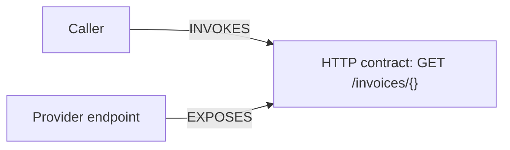

# Graph model in plain language

[Docs](README.md) · [Reading answers](answers.md) · [Architecture](design/architecture.md)

A **node** represents a thing: a file, service, endpoint, package, or topic.
An **edge** records a relationship between two things. Its type and evidence
explain what the arrow means.

## How a connection is built

1. A parser reads one file.
2. An extractor records a **claim**: a local statement such as “this handler
   provides `GET /invoices/{id}`” or “this caller reads `BILLING_URL`.”
3. A **resolver** combines compatible claims from the supplied repositories.
   It uses configuration, names, paths, and protocol details to match them.
4. A **rendezvous node** represents the shared contract where they meet.

The endpoint's `EXPOSES` arrow points toward the contract. A consumer-to-provider
journey therefore needs semantics as well as arrow direction.

## Node families

The source graph has 14 registered node types:

| Types | Represent |
|---|---|
| `Repo`, `Folder`, `File` | Repository and filesystem structure |
| `Class`, `Interface`, `Method`, `Function` | Parsed code entities |
| `ApiEndpoint` | An extracted local route/handler endpoint |
| `Dependency` | A dependency record in a manifest or lockfile |
| `Config` | Parsed configuration |
| `DockerResource`, `KubernetesResource`, `IaCResource` | Infrastructure declarations |
| `ContractClaim` | Extraction evidence used by the linker; usually hidden in the UI |

The linker also creates `Service` nodes and shared nodes labelled `Library`,
`Topic`, `ContractOperation`, `HttpContract`, `ServiceName`, `Team`, `Dataset`,
`Module`, and `DeploymentUnit`. A `Gateway` is an additional label on a service.
These are not additional source-node types in the Repo filter.

For example, `ApiEndpoint` belongs to one repo; `HttpContract` is the common
identity a caller and provider can match. A local `Dependency` record is also
different from the shared `Library` it may resolve to.

## Edge families

These are the 30 distinct registered relationship types. A particular repository
will populate only the types supported by its source evidence.

| Types | Meaning |
|---|---|
| `CONTAINS`, `DECLARES` | Filesystem containment and declared code entities |
| `CALLS` | Supported local symbol calls; heuristic or imported SCIP evidence |
| `EXPOSES_API` | Local handler/source → extracted endpoint |
| `DEPENDS_ON` | Manifest → local dependency, or repo → linked library, depending on endpoints |
| `EVIDENCED_BY` | Claim → source node supporting it |
| `RESOLVED_TO` | Claim → resolved shared identity |
| `HAS_ALIAS`, `MEMBER_OF` | Service aliases and resolved membership |
| `BUILT_FROM`, `BELONGS_TO`, `DEPLOYED_AS` | Service → repository, module, or deployment unit |
| `CALLS_SERVICE`, `ROUTES_TO` | Service topology and gateway routing |
| `DEPENDS_ON_REPO` | Aggregated repository dependency |
| `PUBLISHES` | Repository → published library |
| `DECLARES_CONTRACT`, `EXPOSES`, `INVOKES` | Contract declaration, provider, and consumer relationships |
| `UI_CALLS` | Frontend call site → HTTP contract |
| `DECLARES_TOPIC`, `PUBLISHES_TO`, `CONSUMES_FROM`, `FANS_OUT_TO` | Topic declarations and supported messaging relationships |
| `READS_FROM`, `WRITES_TO` | Code/declarations → dataset |
| `REGISTERS_WEBHOOK` | Webhook registration → callback contract |
| `PERMITS_TRAFFIC` | Declared network/mesh policy; not proof of a call |
| `SAME_OPERATION` | Supported equivalent operations across transports |
| `OWNED_BY` | Repository/service/module → declared owner |

The writer [registries](../backend/tracekite/services/graph_writer.py) define
admitted types. There is no emitted `IMPORTS`, `READS_CONFIG`, or
`DEFINES_CONFIG` edge in 0.2.0; config ownership queries read claims instead.

## Which graph am I walking?

| Surface | Graph and direction |
|---|---|
| Repo canvas | A bounded local source graph, plus supported call/contract bridges for multiple repos |
| Repo **Impact** | Up to two outgoing hops in the loaded local neighborhood |
| Service Map | Supported service/topic topology, with bookkeeping hidden |
| App **Trace** | Service-level traversal with flow-aware topic direction and optional HTTP crossings |
| MCP/Python **neighbors**, **subgraph** | Active linker edges; `in`, `out`, or `both` follows stored arrows |
| MCP/Python **impact** | Backwards through the registered dependency edge types to find dependents |
| MCP/Python **trace** | Up to three shortest directed paths through active linker edges |

An arbitrary method can be found by `node` or `search` yet have no MCP neighbors
because its only relationships are local source edges. Use Repo or lower-level
Python scan/store APIs to inspect those local edges.

Use the exact ID returned by the tool instead of constructing a hash. Line
numbers are evidence, not node identity. Generic names such as `api` or
`frontend` can identify several services and require explicit disambiguation.
